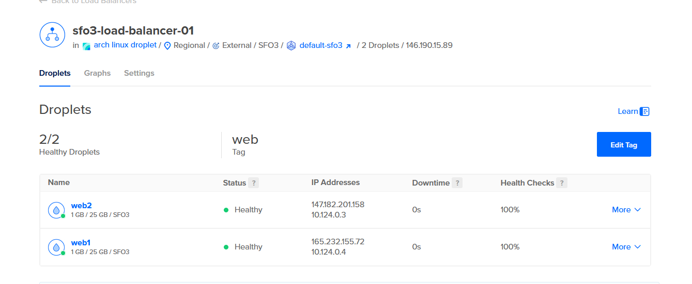
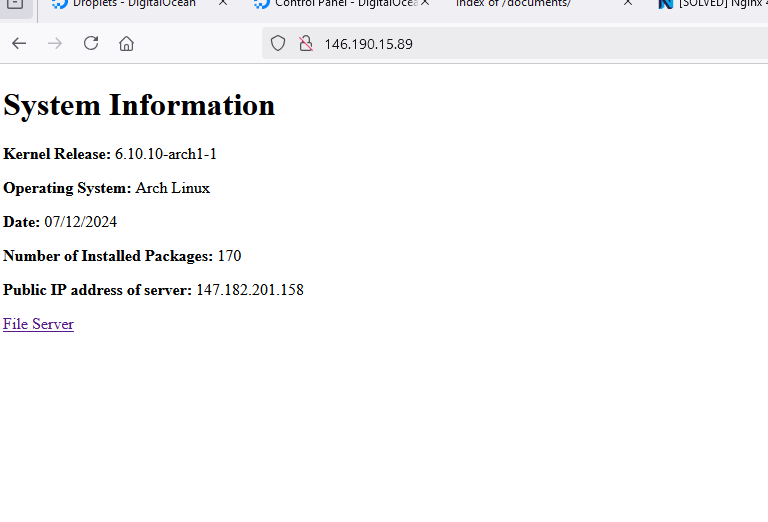
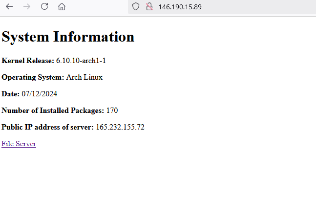
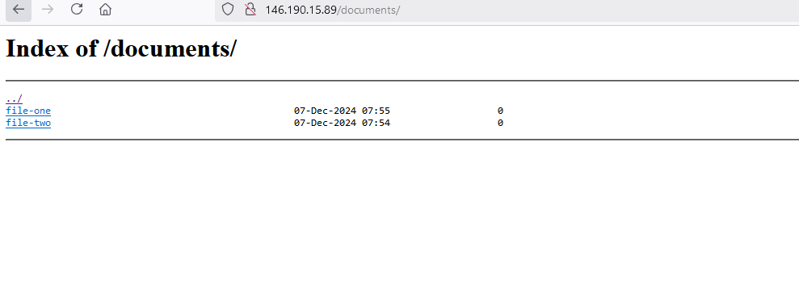

# Load balance set-up

We will need to creat a droplet that will act as our base.

navigate to digital Ocean and create a droplet on your closest server, for me that is SF03

once you have customized it to your liking it is time to follow 5 steps.

## Task 1 User creation

Our goal here is to create a *system* user named webgen with an appropriate login shell as well as a specific directory structure.

    /var/lib/webgen/
    |--bin/
    |   |__generate_index
    |
    |___documents/
    |   |file-one
    |    |file-two
    |
    |__HTML/
        |__index.html

The following commands will 
1. generate a group for webgen
2. generate the user webgen with all needed magic touches


```bash
    sudo groupadd webgen 

    sudo useradd -r -d /var/lib/webgen --group webgen --shell /usr/bin/nologin webgen 
```
- -r creates a system user, can also be flagged as --system
- -d Creates a directory 
- --group decides which group(s) our user will be placed in
- --shell this specifies our new users shell type i.e nologin

### task 1.1 directory extending

We now need to expand the directory to include the bin and HTML forks

```bash
sudo mkdir -p /var/lib/webgen/bin
sudo mkdir -p /var/lib/webgen/HTML
sudo mkdir -p /var/lib/webgen/documents
touch /var/lib/webgen/documents/file-one
touch /var/lib/webgen/documents/file-two
```

- -p creates parent directories where needed.

### task 1.2 directory permissions

Now we must give the required permission to our user so they control the directory

```bash
sudo chown -R webgen:webgen /var/lib/webgen
sudo chmod 700 /var/lib/webgen
```
- The -R flag recursively gives ownership to webgen user and group for the children of the specified path.

## Task 2 Unit Files

We need to make two different unit files here.

1.  generate-index.service
2. generate-index.timer

our service unit file will be in charge of actioning our script and logging anything we want.

our timer unit file will be in charge of when our service file is in use.

### generate-index.service
The following line will let us make a file in the correct location 

```bash
    sudo nvim /etc/systemd/system/generate-index.service
```

```bash
#generate-index.service
[Unit]
Description=Uses webgen user to start a predefined script
Wants=network-online.target
After=network-online.target

[Service]
Type=simple
User=webgen
Group=webgen
ExecStartPre=/bin/echo "Service about to start"
ExecStart=/path/to/your-script.sh
ExecStartPost=/bin/echo "Service has finished"

[Install]
WantedBy=multi-user.target
```
by using ExecStartPre and ExecStartPost we can echo a statement into our journalctl to check our script initiailized correctly

### generate-index.timer

```bash
    sudo nvim /etc/systemd/system/generate-index.timer
```

```bash
[Unit]
Description=Persistent initiating of generate-index.service at 05:00 AM

[Timer]
OnCalendar=*-*-* 05:00:00
Persistent=true

[Install]
WantedBy=timers.target

```

OnCalendar is our timer settings, the three asterisks are used to signify all  months, weeks,days. the systems clock is 24 hours so we simply use 05:00:00 to signify 5 am every day.

Persistent=true the timer will be triggered immediately if system was off during the scheduled calendar trigger time.

### helpful commands

    #check syntax

    sudo systemd-analyze verify /etc/systemd/system/generate-index.timer

    sudo systemd-analyze verify /etc/systemd/system/generate-index.service

    #check status
    sudo systemctl status generate-index."timer/service"

    #check logs
    sudo jounalctl -u generate-index.service/timer

    # run the file

    sudo systemctl enable generate-index.service/timer

    # confirm execution of file

    sudo systemctl show -p ActiveState generate-index.service/timer

## Task 3 NGINX

We need to install nginx and set it up so it has the user webgen.

Install the package

    sudo pacman -S nginx

    sudo nvim /etc/nginx/nginx.confd

Remove everything and paste the following 
```
user webgen webgen;  

events {
    worker_connections  1024;
}


http {
    types_hash_max_size 4096;
    types_hash_bucket_size 64;
    include       mime.types;
    include /etc/nginx/sites-enabled/*;
    default_type  application/octet-stream;
}
```

We will be serving our server through a seperate server block for maximum encapsulation.

### server setup

sudo nvim /etc/nginx/accepted-websites/webgenserver.conf

```
server {
        listen 80;
        server_name "ip"or"localhost";

       location / {
        root /var/lib/webgen/HTML;
        index index.html;
    }


    location /documents {
        root /var/lib/webgen/;
         autoindex on;
        try_files  $uri  $uri/ =404;
    }


}
```

now add the needed perms

    perms sudo chown -R webgen:webgen /var/www/html 

Using a seperate server block outside of the nginx config file gives us levels of seperation for multipurposing our network.

It becomes much easier to serve multiple IP's at once with this style. nginx becomes our traffic control and directs different users to different server configs.

## task 4 firewall

We will be setting up ufw firewall

    sudo pacman -s ufw  

|Rule|explained|command|
|--|--|--|
|22 Limit In Anywhere| limits mutliple hits from the same ssh source to avoid brute force attacks|sudo ufw limit ssh|
|80 Allow in anywhere|This rule allows unrestricted incoming traffic to port 80 which is our http port|sudo ufw allow 80/tcp|
|22 Allow in "IP ADDR"| allows ssh connections from a specific IP|sudo ufw allow from "ipaddr" to any port 22|
|443 Allow in anywhere|port 443 controls https web traffic |sudo ufw allow 443/tcp|

To check and use our firewall we use the following command

    sudo ufw numbered status

    sudo ufw status verbose

    sudo systemctl reload ufw

    sudo systemctl status ufw

    sudo systemctl enable ufw

## now that everything is set-up 

Your server should now serve whatever content is in your

    /var/lib/webgen/HTML/

folder.

## Setting up the second droplet

We have two options here we can either manually/script the setup for a second new droplet.

**OR**

we can save an image of our working functional droplet and create a new droplet based on it saving all the work we have done on it.

## setting up a loadbalancer

To set up the load balancer go to your project in digital Ocean.

1. click create
2. click load balancers
3. set up how you wihs
4. add a tag you want to use for easy droplet categorizing
5. create te balancer
6. add the tag to the droplets you want balanced

Once our balancer loads up and declares our droplets healthy we will be able to serve data from both of our droplets in case one fails.



This is how our load balancer should look. note that both droplets are healthy. 

When you go to your load balancers IP address you can refresh it a few times and get served from both droplets ip addresses as seen below





## proof of downloadable files

Here is my documents page served via my load balancer

